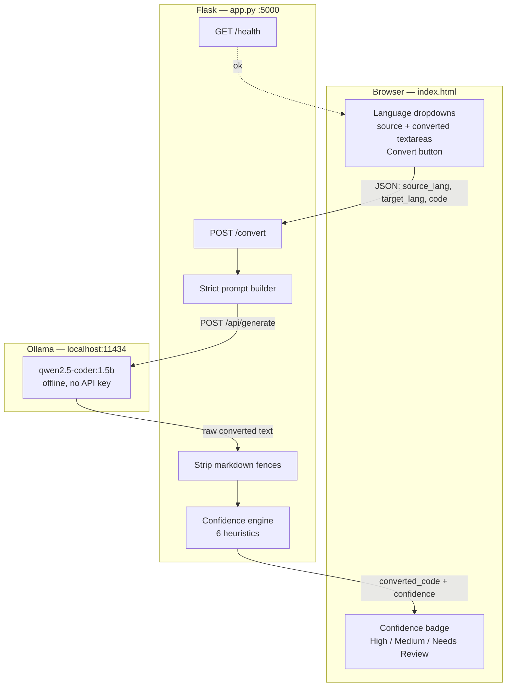
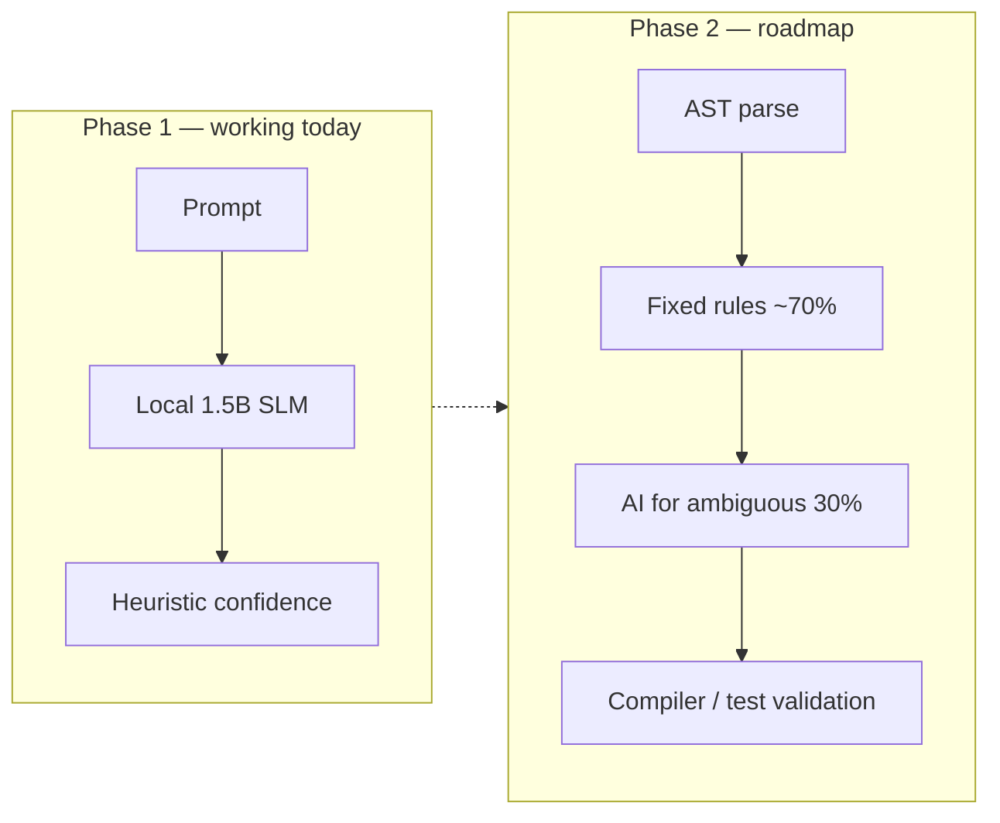

# CodeMigrate — MVP (SIH 2026)

[](LICENSE)

You paste code in one language. We send it to a **free AI model running on your
own laptop** (via Ollama) with a strict prompt: convert this, keep the logic,
output only code. The converted snippet comes back, then a **custom confidence
layer** (static heuristics, not a compiler) flags structural bugs the model
often introduces. The UI shows the output plus a High / Medium / Needs Review
badge.

**License:** MIT (see [`LICENSE`](LICENSE)). Free to use, modify, and share;
keep the copyright notice. Contributions are welcome under the same terms.

**Repo:** https://github.com/mithun-srinivasan/codemigrate-mvp

**Zero cost. No API key. No signup. No credit card.** The model runs entirely
on the machine. Default model: `qwen2.5-coder:1.5b` (~1GB), chosen because
this MVP targets laptops with ~6GB RAM. A 7B model is optional later on
16GB+ machines — it is **not** the setup judges should follow.

That's the whole MVP. No AST parsing, no training — a well-engineered prompt,
a local SLM, and a bug-detection layer. That is intentional: Phase 1 is
working today. Phase 2 (roadmap) adds AST rules + compiler validation.

---

## How the system works

1. **User picks a pair and pastes code** in `index.html` (source language,
   target language, source snippet).
2. **The browser POSTs JSON** to the Flask backend at `http://localhost:5000/convert`.
3. **`app.py` builds a strict prompt** from `PROMPT_TEMPLATE`: preserve logic,
   use idiomatic target patterns, no explanations, no markdown fences, and
   `MIGRATION_NOTE:` comments only when something cannot be translated cleanly.
4. **Ollama runs `qwen2.5-coder:1.5b` locally** at `http://localhost:11434`.
   Nothing leaves the laptop; no cloud API key is required.
5. **The backend strips leftover markdown fences** if the model ignores the
   "code only" rule.
6. **The confidence-check engine** runs six structural heuristics on the
   output (see below). These catch bugs a 1.5B coder model actually produces
   — for example duplicate JSX attributes and undefined identifiers — not
   just "did it compile."
7. **JSON goes back to the UI**: converted code, confidence status
   (`high_confidence` / `medium_confidence` / `low_confidence`), and a list
   of issues shown next to the badge.

```
Paste code  →  Flask prompt  →  local Ollama (1.5b)  →  strip fences
        →  6 heuristic checks  →  code + confidence badge
```

### Confidence-check engine (the judging differentiator)

There is no compiler for every language pair, so the MVP uses **heuristic
bug detectors** instead of "did it compile":

| # | Check | Example of what it catches |
|---|--------|----------------------------|
| 1 | Unbalanced `{}` `()` `[]` | Truncated or broken generation |
| 2 | Duplicate JSX attributes | `<div className="a" className="b">` |
| 3 | Likely undefined variables | `toggle.emit(...)` when `toggle` was never declared |
| 4 | Mismatched / unclosed JSX tags | `<div><span>...</div>` |
| 5 | Missing React hook imports | `useState(...)` used but not imported from `'react'` |
| 6 | Duplicate object keys | `{ name: 'a', name: 'b' }` |
| 7 | Python `ast.parse` (Python targets only) | Invalid syntax in generated Python |

Checks 2–6 run only for JS / TypeScript / React targets so Python/Java/Go
output is not spammed with JSX false positives.

`MIGRATION_NOTE` comments from the model count as **medium** confidence
(manual review). Structural bugs above force **low** confidence ("Needs Review").

These checks were validated on a real Angular `TodoItemComponent` → React
conversion where the 1.5B model emitted a duplicate `className` and an
undefined `toggle` reference — the engine flagged `low_confidence` with the
right issues, and did not false-positive on clean Python → JavaScript output.

### Demo snippets (loaded in the UI)

| Button | Pair | Why it's in the demo |
|---|---|---|
| Python → JS (clean) | Python → JavaScript | Happy path / high confidence |
| ShoppingCart | Python → JavaScript | Class, loops, exceptions |
| Angular TodoItem | Angular → React | Real 1.5b bugs (duplicate `className`, undefined `toggle`) |
| Angular LoginForm | Angular → React | Reactive forms → React state |
| Angular RxJS service | Angular → React | `Observable` / `HttpClient` → `fetch` + `useEffect` |
| Java Stack | Java → Python | Non-JS pair; Python `ast.parse` on output |

Add more: drop a file in `examples/` and a row in `examples/manifest.json`.

---

## Architecture

Phase 1 is a **single conversion path**: UI → Flask → Ollama → static analysis.
There is no AST rules engine in this MVP; that is the documented Phase 2.





**Privacy / cost:** source code never leaves the laptop. Inference is local.
Open the UI at **http://localhost:5000** (Flask serves `index.html`).

---

## Files

- `app.py` — Flask backend: prompt, Ollama, confidence checks, example API.
- `index.html` — UI (served by Flask).
- `examples/` — demo snippets + `manifest.json` (add files here for new demos).
- `tests/test_confidence.py` — detector tests (no Ollama).
- `CONTRIBUTING.md` — how teammates should change the repo.
- `requirements.txt` — `flask`, `flask-cors`, `requests`, `pytest`.
- `check-specs.ps1` — optional RAM/CPU helper. Default model is still 1.5b.

---

## How to run it (do this once) — FREE, no account needed

```
git clone https://github.com/mithun-srinivasan/codemigrate-mvp.git
cd codemigrate-mvp
```

**Step 1 — Install Ollama (one time, ~5 min):**
- Go to https://ollama.com/download
- Download and install for your OS (Windows/Mac/Linux all supported)

**Step 2 — Download the default AI model (one time, ~1GB):**
Open a terminal/command prompt and run:
```
ollama pull qwen2.5-coder:1.5b
```
This is the model `MODEL_NAME` in `app.py` already points at. Only needed once.

> Optional, **not** the judge demo path: on a machine with **16GB+ RAM** you
> can try `ollama pull qwen2.5-coder:7b` and change `MODEL_NAME` in `app.py`.
> On ~6GB RAM laptops the 7B model will swap, stall, or crash.

**Step 3 — Install Python packages:**
```
pip install -r requirements.txt
```

**Step 4 — Start Ollama (if not already running automatically):**
```
ollama serve
```
(On Windows/Mac it usually starts automatically after install — you'll see a llama icon in the system tray/menu bar.)

**Step 5 — Start the backend:**
```
python app.py
```
It should say it's running on http://localhost:5000

**Step 6 —** In the browser open **http://localhost:5000** (do not double-click
`index.html`). Click a demo snippet or paste code, then Convert.

**Tests (collaborators, no Ollama):**
```
pytest -q
```

---

## Troubleshooting

- "Can't reach Ollama" error → make sure `ollama serve` is running in a terminal
- Very slow first response → normal (model loads into RAM); later calls are faster
- Out of memory / machine freeze → stay on `qwen2.5-coder:1.5b`; do not pull 7b
- Backend not found in the UI → `python app.py` must be running on port 5000
- `python` not recognized on Windows → use `py app.py` and `py -m pytest -q`

---

## How to explain this to teammates (and judges)

"We built a code migration tool. You paste in code, pick source and target,
and it sends the snippet to a free coding model (Qwen2.5-Coder **1.5B**)
running locally via Ollama — no API costs, no cloud dependency — with a
specific instruction: convert this exactly, keep the logic, don't explain,
don't add markdown. The model returns converted code. Then we run a custom
static-analysis layer — duplicate JSX attributes, undefined variables,
unclosed tags, missing hook imports, duplicate object keys, unbalanced
brackets — and show a confidence badge so the user knows whether to trust
the output or review it.

Running the model locally is a pitch point: fully offline, company code
never leaves the laptop, zero cost to demo.

The backend is one Python file (Flask). The frontend is one HTML file —
no framework. Phase 1 is prompt + SLM + heuristics, working today. Phase 2
adds AST parsing so fixed rules cover the common 70% of patterns, and the
AI is reserved for ambiguous logic, plus real compiler-based validation."

---

## For collaborators

Start with [CONTRIBUTING.md](CONTRIBUTING.md). Summary:

1. Run `pytest -q` after any detector change.
2. New demo: add a file under `examples/` and a row in `examples/manifest.json`.
3. New detector: function in `app.py` → call from `basic_confidence_check` → test → README table row.
4. Prompt-only changes stay in `PROMPT_TEMPLATE`. Keep the stack Flask + one HTML file + local Ollama.

### Open work (good first PRs)

Pick one. Do not mix a Phase-2 rewrite into a first PR.

- Side-by-side **diff highlighting** of source vs converted
- Stream Ollama tokens so the UI is not stuck on “Converting…”
- Optional **Groq free-tier fallback** if live Ollama is too slow
- Chunk large files function-by-function
- Conversion **history** (localStorage is enough)
- `node --check` when the target is JS and Node is installed

Phase 2 (later, team decision): AST rules for common Angular→React patterns,
compiler validation, not a new frontend framework.
